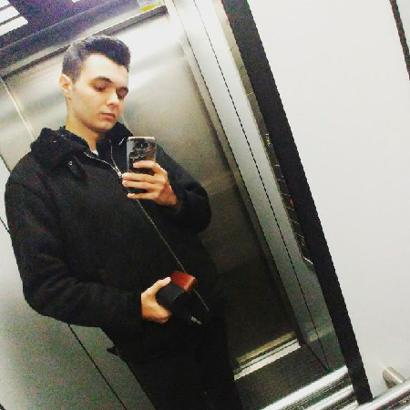

# Introduction

Kebab Engine is a video game engine for 3D games. It has been developed as an assigment for the subject of Game Engines in the third year at CITM-UPC's university degree of design and development of videogames. The objective of the subject is to create a game engine from zero using OpenGL, this is the final result.

Hope you like it and it's useful for your projects.

# Team members

### David Jesus González López

Programmer

[Linked In](https://www.linkedin.com/in/david-jes%C3%BAs-gonz%C3%A1lez-l%C3%B3pez-03a2041b1/)

[Github](https://github.com/MagiX7)

### Carlos Megia Zubillaga

Programmer

[Linked In](https://www.linkedin.com/in/carlos-megia-zubillaga-b64bb31b7/)

[Github](https://github.com/Chuchocoronel)

# Core sub-systems

### GameObjects

Based on an entity and component system, every gameobject is unique and it could have different components attached to it: transform, mesh, material and camera, all inherit from a component base class.

All the game objects have a parent and it allow to have children, creating a tree structure and as a consequence, a hierarchy.

### Components

The base to create all the game objects, because all game objects have components:

- **Transform:** allow the gameobject to move around the scene with a local or global transformation.
- **Mesh:** enable to include 3D meshes to render on the scene.
- **Material:** give the ability to renderize 2D textures on the mesh of the gameobject and also shaders.
- **Camera:** allow to create a camera and renderize the in-game from that point of view.

### Frustum

The base for the camera viewport, it allows to modify easily the characteristics of the camera view, and also is the main part for the **Camera Culling** that discart gameobjects from rendering if they aren't inside the frustum/camera, optimizing the engine.

### File resources manager and explorer

The engine controls all the things related with meshes, textures, shaders and scenes. The resource manager regenerate missing files, create custom files for optimization and use reference counting on all of the resources used by the gameobjects.

On the other way, the file explorer allows the user to navigate through the files, drag and use them to the scene or eliminate them if not necessary.

### Quadtree

The quadtree is used for optimization in collisions, when a gameobject is set static enters the quadtree and when the cube is full it divides in 4 parts. The collisions only works on cubes that are inside the camera frustum and the other are discarted. In our engine is used for mouse picking raycast and frustum culling.

### Bounding boxes 

Bounding boxes are a very important system to detect collisions between gameobjects and optimize things, like quadtree or camera culling. Using AABB, a container used to create boxes based on the mesh of the model, is how we create the bounding boxes or colliders.

### Scenes simulation and serialization

Kebab engine can save and load diferent scenes, using it's own custom format. Not only that, also can start/stop a simulation or advance frame by frame, being the start to create videogames.

# Shaders

For the third and last assigment we decide to create the Shader pipeline using OpenGL. All the new meshes with materials have a basic shader, from there you can modify them.

# Video demo

<iframe width="560" height="315" src="" title="YouTube video player" frameborder="0" allow="accelerometer; autoplay; clipboard-write; encrypted-media; gyroscope; picture-in-picture" allowfullscreen></iframe>

# Links

Download the last release of Kebab Engine [Here]()

Github link to the engine repository [Here](https://github.com/MagiX7/Kebab-Engine)

# License

*MIT License*

*Copyright (c) 2021 David González and Carlos Megia*

*Permission is hereby granted, free of charge, to any person obtaining a copy
of this software and associated documentation files (the "Software"), to deal
in the Software without restriction, including without limitation the rights
to use, copy, modify, merge, publish, distribute, sublicense, and/or sell
copies of the Software, and to permit persons to whom the Software is
furnished to do so, subject to the following conditions:*

*The above copyright notice and this permission notice shall be included in all
copies or substantial portions of the Software.*

*THE SOFTWARE IS PROVIDED "AS IS", WITHOUT WARRANTY OF ANY KIND, EXPRESS OR
IMPLIED, INCLUDING BUT NOT LIMITED TO THE WARRANTIES OF MERCHANTABILITY,
FITNESS FOR A PARTICULAR PURPOSE AND NONINFRINGEMENT. IN NO EVENT SHALL THE
AUTHORS OR COPYRIGHT HOLDERS BE LIABLE FOR ANY CLAIM, DAMAGES OR OTHER
LIABILITY, WHETHER IN AN ACTION OF CONTRACT, TORT OR OTHERWISE, ARISING FROM,
OUT OF OR IN CONNECTION WITH THE SOFTWARE OR THE USE OR OTHER DEALINGS IN THE
SOFTWARE.*
